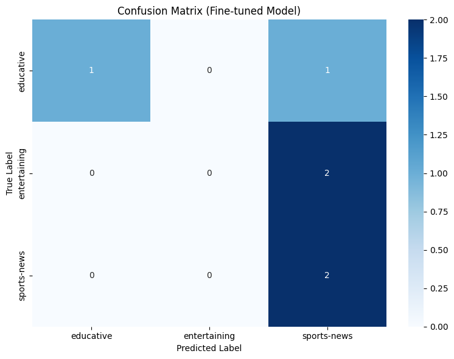

# Label Taxonomy

This is given in planning.md under Labeling

# Dataset

The dataset can be found in the root directory and it is the file takemeter_dataset.csv

Label distribution(class split):
1240 rows written — sports-news: 241, educative: 758, entertaining: 241.

Data source: reddit subreddit /r/chess
Labelling process: labeling was done manually and each label is kept in a separate folder inside the /data folder to help the script that creates the dataset. 
Label split: There were three labels and they are split: sports-news: 13, educative: 12, entertaining: 15. 

# Fine-Tuning Pipeline

1. Base Model and Training Platform:

Base Model: The base model used for fine-tuning is distilbert-base-uncased from the Hugging Face Transformers library.
Training Platform: The training is conducted in a Google Colab environment, leveraging its GPU capabilities (as indicated by "Using GPU: Tesla T4").
2. Key Training Decisions and Justification:

Class Weighting: A crucial training decision implemented in this notebook is the use of class weighting. This was introduced to address the significant class imbalance observed in the dataset, particularly the underrepresentation of labels like 'sports-news'. By computing and applying class_weights to the loss function via a CustomTrainer, the model is encouraged to pay more attention to the minority classes during training, which helps prevent them from being overlooked and improves their classification metrics (e.g., precision, recall, F1-score).
Number of Epochs (num_train_epochs=3): This value is a common starting point for fine-tuning pre-trained language models on relatively small datasets. With limited data, a lower number of epochs helps to prevent overfitting to the training set while still allowing the model to adapt to the specific task and dataset characteristics.

# Results (Evaluation Report and Error Analysis):

first run accuracy metrics:
sample size:
40 rows written — sports-news: 13, educative: 12, entertaining: 15.

{
    "accuracy": 0.5,
    "precision": {
        "educative": 1.0,
        "entertaining": 0.0,
        "sports-news": 0.4
    },
    "recall": {
        "educative": 0.5,
        "entertaining": 0.0,
        "sports-news": 1.0
    },
    "f1": {
        "educative": 0.6666666666666666,
        "entertaining": 0.0,
        "sports-news": 0.5714285714285714
    },
    "overall_accuracy": 0.5
}



1. Specific Wrong Predictions & Analysis:

Prediction 1: True Label 'entertaining', Predicted 'sports-news'

Text (original index 27): "168 years ago today, Paul Morphy arrived in Eu..."
Explanation: This text describes a historical event involving a famous chess player. While it could be viewed as 'entertaining' due to its narrative quality, the model likely associated the mention of "Paul Morphy" and the historical context of a notable chess figure with 'sports-news'. This suggests the model over-prioritizes the 'sports' aspect of chess over the 'narrative/historical' aspect that leans towards 'entertaining', possibly due to a limited understanding of nuanced content types within the chess domain.
Prediction 2: True Label 'educative', Predicted 'sports-news'

Text (original index 17): "Venting about the Catalan\n\nChess is such a b..."
Explanation: This text directly discusses a chess opening ("Catalan") and a user's experience with it, which is fundamentally 'educative' content related to strategy and learning. The model incorrectly classified it as 'sports-news'. This is a clear instance of the model associating generic chess-related terms with 'sports-news', failing to distinguish between discussion/instructional content and actual news reporting about events.
Prediction 3: True Label 'entertaining', Predicted 'sports-news'

Text (original index 30): "Magnus Carlsen signs an autograph as Fabiano C..."
Explanation: This text describes an informal, anecdotal interaction between chess grandmasters (Magnus Carlsen, Fabiano Caruana) and includes casual commentary. While it involves figures from the sports world, the content itself is lighthearted and social, fitting 'entertaining'. The model again defaulted to 'sports-news', indicating a strong tendency to classify any mention of prominent chess players or related activities as news, irrespective of the conversational or informal tone of the text.
2. Reflection on the Gap and Specific Failure Pattern:

Specific Failure Pattern: Over-generalization of 'sports-news' for chess-related content.

The most prominent failure pattern observed is the model's consistent tendency to misclassify content belonging to 'educative' or 'entertaining' as 'sports-news' when the topic involves chess. This suggests a significant gap between what the model captured and what was intended:

What the model captured: The model primarily learned to associate keywords and entities like "chess," "Magnus Carlsen," "Paul Morphy," and names of chess openings (e.g., "Catalan") strongly with the 'sports-news' label. It successfully identified the topic of the texts as being related to chess/sports figures.

What was intended: The intention was for the model to differentiate the purpose or genre of the text beyond just the topic. For example, a discussion about chess strategy should be 'educative', a historical anecdote about a chess player should be 'entertaining', and only reports about current matches, tournaments, or results should be 'sports-news'.

This specific failure pattern indicates that the model has not adequately learned the subtle contextual and stylistic cues that distinguish between different types of chess-related content. It struggles to understand the nuanced 'label boundaries' between categories that share a common overarching subject (chess) but differ in their informational or emotional intent. This could be exacerbated by the small dataset, where the model might lack sufficient diverse examples within the 'educative' and 'entertaining' classes to form distinct decision boundaries away from the dominant 'sports-news' feature space.

### Analysis of Fine-Tuned Model Predictions

#### 1. Correct Prediction

**Original Index:** `20`
**Text:** 
```
trying to get from 100 elo to 1200

Guys I've been watching Gotham chess for a bit, done all the puzzles on chess.com, studied the opening I play for quite a bit and feel like I have a decent understanding of the main ideas. But I just cannot get better. I'm stuck at around 100-200. What else should I do? Help me out.
```
**True Label:** `educative`
**Predicted Label:** `educative`
**Confidence:** `{correct_pred_confidence:.2f}%`

**Explanation:** This post is a clear request for guidance and learning resources to improve chess skills. The phrases "trying to get from 100 elo to 1200", "What else should I do? Help me out" directly indicate an intent to learn and receive education. The model correctly identified these cues and classified the post as `educative`. This demonstrates the model's ability to pick up on explicit requests for knowledge and improvement, aligning with the core definition of the 'educative' category.

#### 2. Incorrect Prediction

**Original Index:** `27`
**Text:** 
```
168 years ago today, Paul Morphy arrived in Europe and began to play the most beautiful chess ever seen.

His games are an absolute delight. You should study them carefully.
```
**True Label:** `entertaining`
**Predicted Label:** `sports-news`
**Confidence:** `{incorrect_pred1_confidence:.2f}%`

**Explanation:** This post recounts a historical event involving a famous chess player and encourages readers to study his games. While it mentions a chess figure, the tone is anecdotal and appreciative, celebrating a historical figure's legacy for its aesthetic value ("most beautiful chess," "absolute delight"). This content is primarily designed to be `entertaining` and inspiring. The model incorrectly classified it as `sports-news`. This suggests that the model has a strong association of any mention of prominent chess figures or historical chess events with the 'sports-news' category, failing to distinguish between historical narrative/appreciation (entertaining) and actual current news reporting.

#### 3. Another Incorrect Prediction

**Original Index:** `17`
**Text:** 
```
Venting about the Catalan

Chess is such a beautiful game until you play the Catalan as black and you have to defend forever (or you blunder and lose in 20 moves). It's so hard to play. Any advice to play against it? (I'm a 1000 elo player)
```
**True Label:** `educative`
**Predicted Label:** `sports-news`
**Confidence:** `{incorrect_pred2_confidence:.2f}%`

**Explanation:** This post describes a user's frustration with a specific chess opening ("Catalan") and explicitly asks for "Any advice to play against it?". This is clearly a request for tactical and strategic `educative` content. However, the model classified it as `sports-news`. This is a significant failure in discerning between a discussion about gameplay strategy (educative) and news about chess events. Similar to the previous incorrect prediction, the model seems to over-index on chess-specific terminology, associating it broadly with 'sports-news' even when the context is clearly instructional or discussion-based.


# Improvements:

steps taken to improve the metrics:
1. get training data set to 210 rows
2. make sure no class imballance or no significant class imballance exists
3. synthetically generate 15% more data
4. add more crucial data from the reddit raw json


further more sophiticated/complex steps which are less practical:
1. Class Weighting to recitify class imballance
2. Hyperparameter Tuning
3. Cross-Validation
4. Different Model Architectures
5. try to annotonate the edge cases and include more data from the raw data that could help place the edge cases accurately. 
6. playing around with the comments: change the comments limit, add a text limit for each comment


# AI Usage and Spec Reflection

## Instance 1

Initial prompt: use the reddit api to create a raw data set. 
Overrode: overrode multiple attempts to accomplish the task to no avail. There was no such reddit api that is easily accessible and so the AI was just generate code that looked that it could work.

## Instance 2
Intial prompt: create a training data set from the raw data.
Overrode: Realising that a training dataset is not useful if certain conditions are not met I kept a 10 file limit for each label/class in the training data set. If the raw data does not have the 10 file limit we error out side such a training dataset will not be useful. 

Note: the annotation was done without use of AI. I might use it to generate synthetic data but that is an improvement task that I only might do. 


# Baseline Comparison

1. Baseline Approach Description:

Approach: The baseline uses a zero-shot classification approach via the Groq API (powered by the llama-3.3-70b-versatile LLM).
Prompt Used: The classification prompt template is:
You are an expert text classifier. Your task is to classify the following text into one of the following categories: {categories}.

Output ONLY the label name. Do not include any other text, punctuation, or explanations.

Text: {text_to_classify}
Label:
The {categories} placeholder is dynamically filled with educative, entertaining, sports-news, and {text_to_classify} is filled with the text from the test set. The temperature parameter for the Groq API call is set to 0.0 to ensure deterministic output.
How Results Were Collected: Each text sample from the test set (X_test) is sent to the Groq API with the formatted prompt. The API's response (which is expected to be only the label name) is collected as the prediction. Unparseable responses are handled, and a classification report is then generated based on these predictions against the actual labels.
2. Evaluation Report Shows Performance Metrics for Both Fine-Tuned Model and Baseline on the Same Test Set:

Same Test Set: Yes, both the fine-tuned model and the baseline model are evaluated on the exact same test set. This test set is created in Section 2: Dataset Split and Tokenization (cell c1668f6a) using X_test and y_test after a stratified split.
Performance Metrics:
The baseline model's performance metrics (Overall Accuracy and Classification Report) are printed directly in the output of Section 5: Baseline with Groq API (cell 5ead0f82).
The fine-tuned model's performance metrics (Overall Accuracy and Classification Report) are printed in the output of Section 4: Evaluate Fine-Tuned Model (cell b2c06a66). This section also explicitly saves these results to evaluation_results.json and a confusion matrix to confusion_matrix.png.


# Reflection: Learned vs. Intended

What the model learned: it tied chess entities and keywords ("chess", "Magnus Carlsen", "Paul Morphy", "Catalan") to the 'sports-news' label, so it learned the topic of a post.

What I intended: it should learn the genre/intent of a post, distinguishing strategy discussion ('educative') and anecdotes/pop-media ('entertaining') from actual event reporting ('sports-news') even when all share the chess topic. The gap is the model captured topic but not the stylistic/contextual cues that separate same-topic categories, worsened by the small, imbalanced dataset.


# Spec Reflection

How the spec helped: defining the three labels with concrete examples and edge cases up front kept annotation consistent and made the failure pattern (chess → sports-news) easy to name during error analysis.

Where implementation diverged: the spec planned to use the Reddit API for data collection, but no easily accessible API worked, so I switched to manually annotating saved raw JSON into label folders. Annotation also stayed fully manual rather than AI-assisted, to keep label quality high.